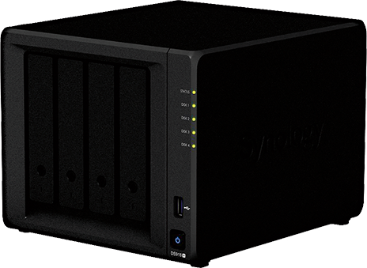
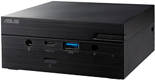

## What is a homelab?

### Where I started

Tulip DT 486 SX 
* 66MHz 486 CPU
* 16MB RAM
* 10mbit TP + Coax Network Adapter

Windows NT Server as Domain Controller

### Previous Homelab

What ever old laptop i was no longer using with a linux installation.

### Current Lab

| Synology Diskstation | Asus PN51 |
|---|---|
|  |  |
| [About](../diskstaion/README.md) | [About](../pn51/README.md) |