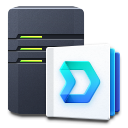
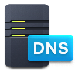

## Diskstation Configuration

Diskstation DS918+.
* Intel Celeron J3455 Quad Core 1.5 burst up to 2.3 GHz
* 4GB DDR3L Memory
* 4x 8TB WD Red NAS Drive
* Dual RJ-45 1GbE LAN in IEEE 802.3ad Draft V1 XOR Link aggregation

### Internal Applications
| Logo | Name | Description |
|---|---|---|
|  | iSCSI LUN | Storage over Network|
|  | LDAP | Centralized user management |
|  | Drive | Distributed File Synchronization |
|  | Internal DNS | For internal DNS to avoid leaving Domain |
|   | Hyper Backup | Local and Remote Backup Snapshots |
|  | MariaDB | MySQL like database (Unused) |
|  | Docker  | See [Docker Section](##Docker Containers) |

### Docker Containers
The following containers are "production" and running at all times.

| Logo | Name | Description |
|---|---|---|
|  | [Authelia](https://www.authelia.com) | HTTPAuthProxy allowing LDAP authentication via Basic or oAuth |
|  | [Traefik](https://traefik.io/) | Loadbalancer From Internet to Diskstation and K3S |
|  | [Prometheus](https://prometheus.io/) | Monitoring of network trafik |
|  | [Grafana](https://grafana.com/) | Presentation ofmonitoring data  |
|  | [Docker Registry](https://hub.docker.com/_/registry) | Internal Docker registry for home built containers. |

## Loadbalancer Configuration
Traefik diverts trafic from Internet to Diskstation or K3s based on DNS.

Traefik can also divert Authentication to Authelia that does LDAP lookups for users and realms using 
[ForwardAuth Middleware](https://doc.traefik.io/traefik/middlewares/http/forwardauth/)

[Back](../about-homelab/README.md)