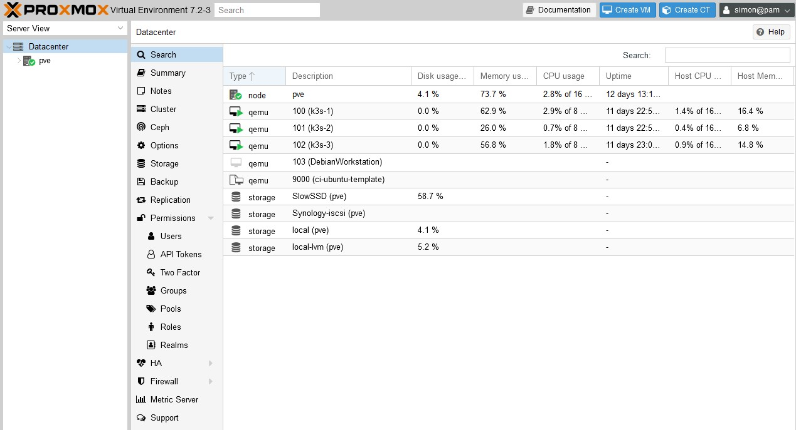

## HomeLab Server Configuration

Asus PN51
* AMD Ryzen™ 7 5700U Processor 1.8GHz (12M Cache, up to 4.3GHz)
* Integrated - Radeon™ Vega Graphics
* Gigabit LAN, Realtek® 8111EP
* 32GB Crucial Ballistix LDDR4 Memory
* 1TB Samsung 980 NVME PCIE4.0 

### Virtualization Engine

Connfigurable throug Web interface

ssh or [Terraform](https://registry.terraform.io/providers/Telmate/proxmox/latest/docs)

[Back](../about-homelab/README.md)